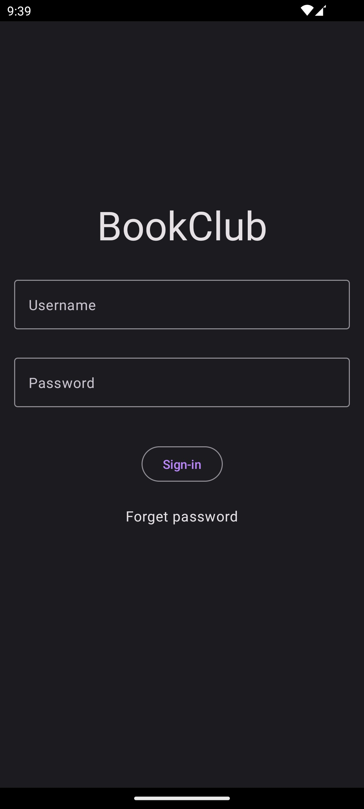
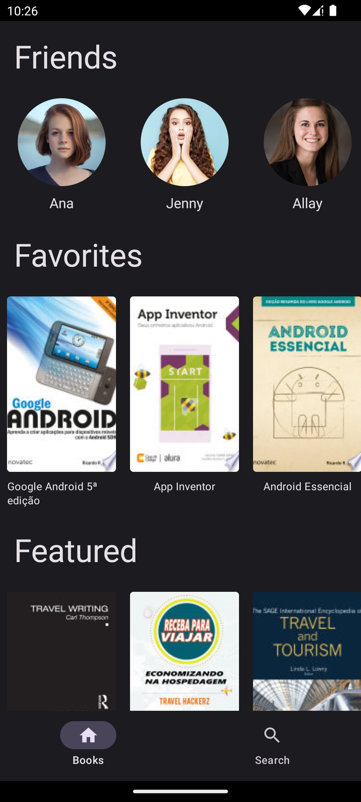
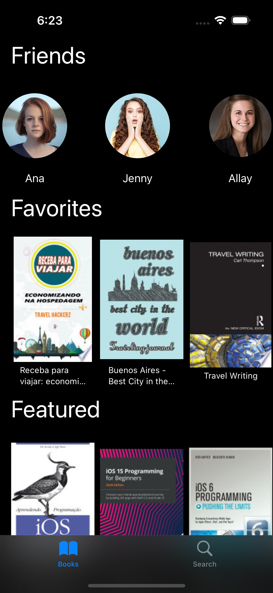
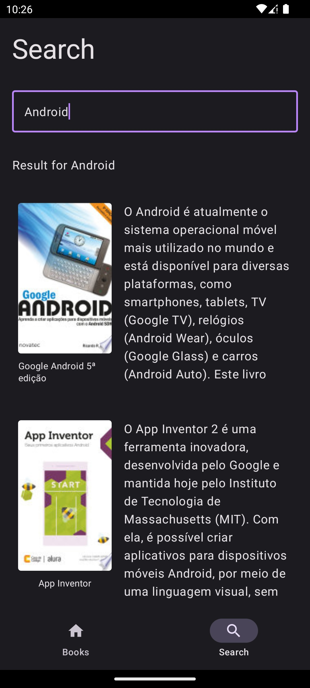
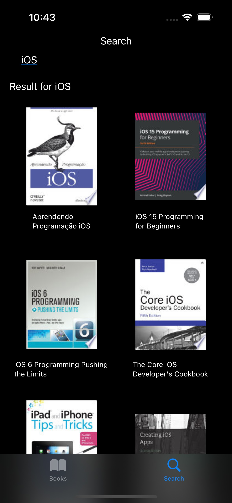

# Bookclub KMP (WIP)

This is a <b>Kotlin Multiplatform</b> app (demo).
It uses <b>SwiftUI</b>, <b>Jetpackage Compose</b> to build UI and share the Domain and Data layers using KMP.
- This app try to simulate a small social network that users can search for books using Google's books api.

## Credentials
Use this credentials to sign-in.
- username: anything (not empty)
- password: anything (string > 6)

### Sign-in Screen

|Android|iOS|
|-|-|
|||
|||

### Home Screen

|Android|iOS|
|-|-|
|||
|||

### Search Screen

|Android|iOS|
|-|-|
|||
|||
